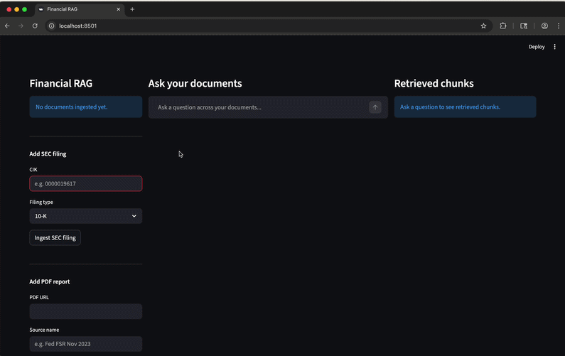

# Financial RAG — SEC Filing Q&A

A RAG-powered API and dashboard for querying SEC filings and financial stability reports in natural language.

## Architecture
```
Streamlit dashboard → FastAPI backend → pgvector (PostgreSQL)
                                      → OpenAI (embeddings + chat)
                                      → SEC EDGAR API / PDF sources
```



## Stack

- **Backend** — FastAPI, LangChain, OpenAI, pgvector
- **Frontend** — Streamlit
- **Infra** — Docker, Kubernetes, AWS EKS

## Quick start
```bash
# 1. clone
git clone https://github.com/dannili/financial-rag
cd financial-rag

# 2. set env
cp .env.example .env
# add your OPENAI_API_KEY to .env

# 3. run
docker compose up --build

# API → http://localhost:8000
# Dashboard → http://localhost:8501
# Swagger → http://localhost:8000/docs
```

## Usage

### Ingest a SEC filing
```bash
curl -X POST http://localhost:8000/ingest/sec \
  -H "Content-Type: application/json" \
  -d '{"cik": "0000019617", "filing_type": "10-K"}'
```

### Ingest a PDF report
```bash
curl -X POST http://localhost:8000/ingest/pdf \
  -H "Content-Type: application/json" \
  -d '{
    "url": "https://www.federalreserve.gov/publications/files/financial-stability-report-20231110.pdf",
    "source_name": "Fed FSR Nov 2023"
  }'
```

### Query
```bash
curl -X POST http://localhost:8000/query/ \
  -H "Content-Type: application/json" \
  -d '{"question": "What interest rate risks does JPMorgan disclose?"}'
```

## API endpoints

| Method | Endpoint | Description |
|--------|----------|-------------|
| GET | `/health` | Health check |
| GET | `/documents/` | List ingested documents |
| POST | `/ingest/sec` | Ingest SEC EDGAR filing by CIK |
| POST | `/ingest/pdf` | Ingest PDF report by URL |
| POST | `/query/` | Query with RAG |
| POST | `/query/stream` | Query with streaming SSE |

## Deploy to AWS EKS
```bash
# create cluster
eksctl create cluster --name financial-rag --region us-east-1 --nodes 2

# push images to ECR
aws ecr create-repository --repository-name financial-rag-api
aws ecr create-repository --repository-name financial-rag-streamlit

docker tag financial-rag-api:latest YOUR_ECR_REPO/financial-rag-api:latest
docker push YOUR_ECR_REPO/financial-rag-api:latest

# update image refs in k8s/api.yaml and k8s/streamlit.yaml
# then apply manifests
kubectl apply -f k8s/
```

## Data sources

| Source | Type | Access |
|--------|------|--------|
| SEC EDGAR | 10-K, 10-Q filings | Free REST API |
| Federal Reserve | Financial Stability Reports | Public PDF |
| IMF | Global Financial Stability Reports | Public PDF |

## Project structure
```
financial-rag/
├── app/
│   ├── routers/        # ingest, query, documents
│   ├── services/       # embedder, vector_store, chunker, llm
│   ├── db/             # init.sql
│   ├── main.py
│   ├── config.py
│   └── models.py
├── streamlit/
│   └── app.py
├── k8s/                # Kubernetes manifests
├── Dockerfile
├── Dockerfile.streamlit
└── docker-compose.yml
```